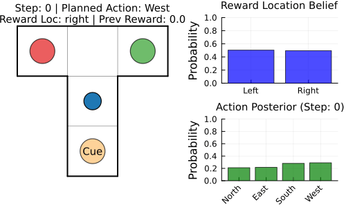

# Parameter Learning in Discrete Active Inference via Message-Passing

Code and figures for `main.pdf`: discrete POMDP active inference with unknown transition and observation parameters, implemented as EFE minimization via variational message passing in [RxInfer.jl](https://github.com/ReactiveBayes/RxInfer.jl).

## Results

The T-maze agent plans with epistemic priors so it both seeks the reward and learns Dirichlet beliefs over the A (observation) and B (transition) tensors. Representative behavior:

Quantitative exports (open in the repo or your PDF viewer):

| Figure | What it shows |
|--------|-----------------|
| [p_cumulative_success.pdf](figures_export/p_cumulative_success.pdf) | Cumulative success vs episodes: message-passing agent vs KL-control baseline |
| [observation_model_A_learning.pdf](figures_export/observation_model_A_learning.pdf) | Belief / error dynamics for the observation model |
| [transition_model_B_learning.pdf](figures_export/transition_model_B_learning.pdf) | Belief / error dynamics for the transition model |

## Run the code

Open [`T-Maze_ExpAmb_Param.ipynb`](T-Maze_ExpAmb_Param.ipynb) with **Julia 1.11+** (see notebook for `Pkg.activate` and dependencies). Keep `T-Maze.png`, `FFG-tmaze.svg`, and this GIF in the same folder as the notebook.

## References

- [EFE as VI](https://arxiv.org/abs/2504.14898) · [Message-passing EFE](https://arxiv.org/abs/2508.02197) · [RxInfer EFE example](https://examples.rxinfer.com/categories/advanced_examples/efe_minimization_via_message_passing)

Cite `main.pdf` for this work; use the PDF for full bibliographic data.
